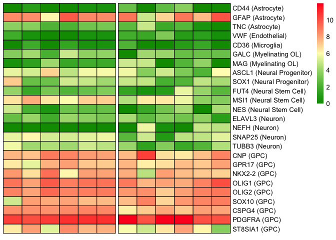
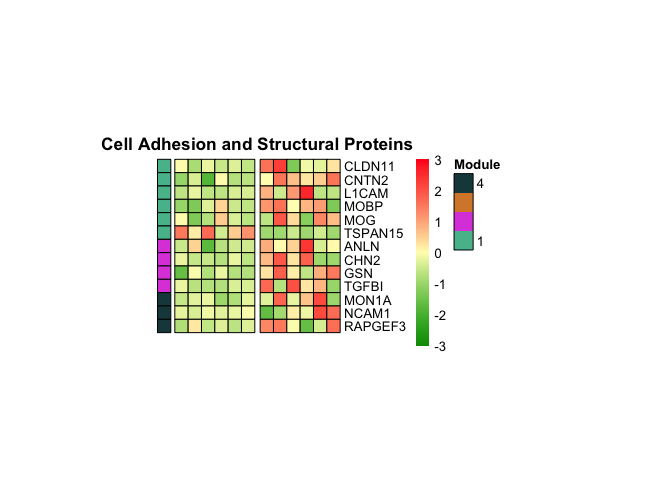
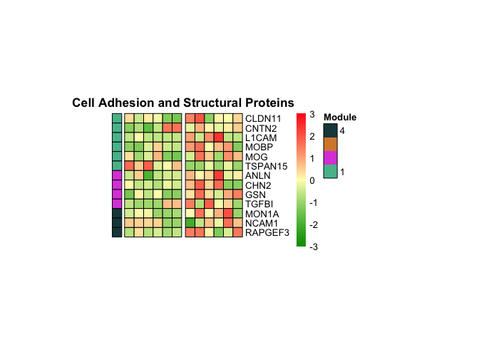
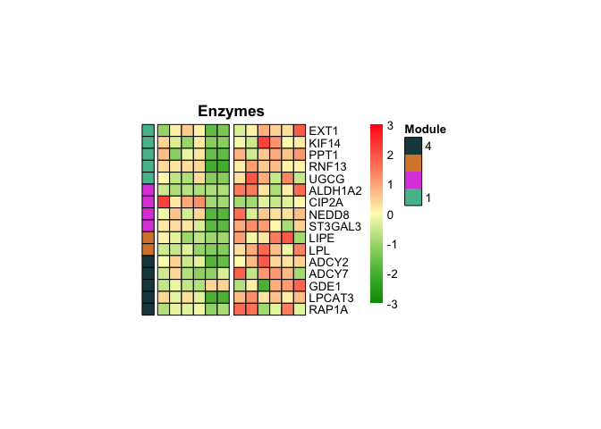
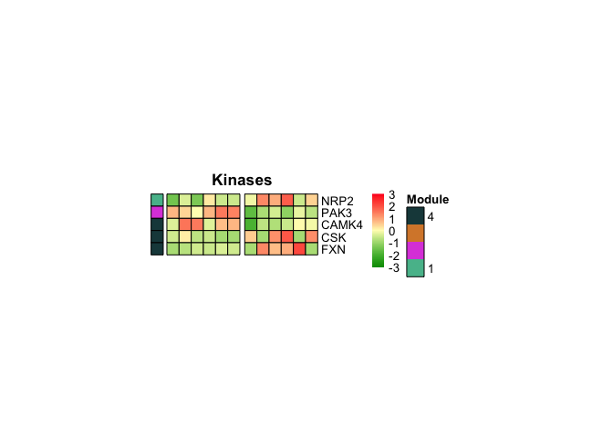
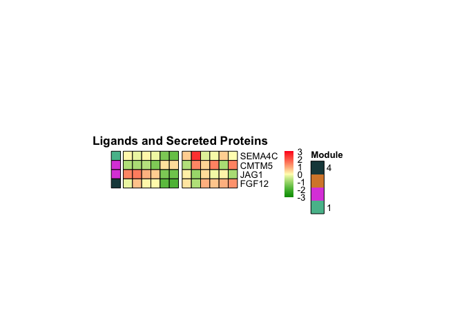
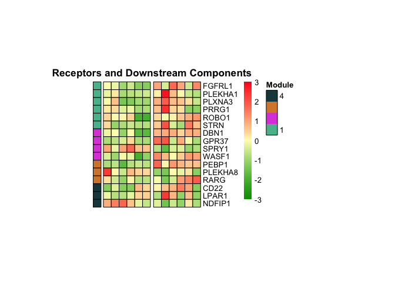
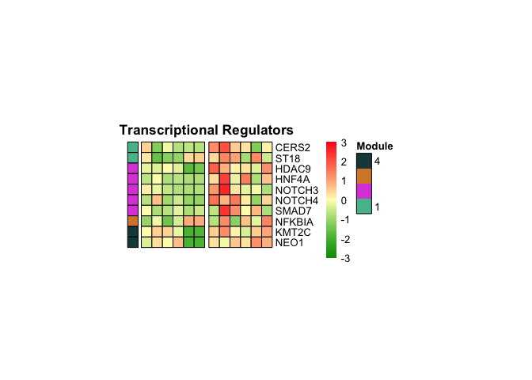
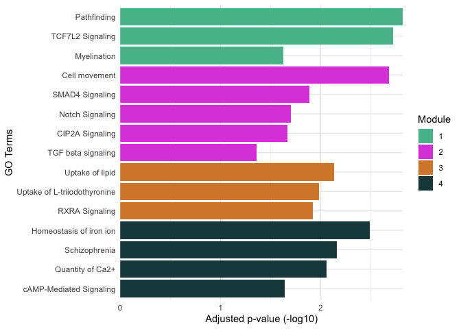

Bulk RNA-Seq Analysis of Control and Remyelinating hGPCs in vivo
================
John Mariani
1/30/2020

### Read in RSEM gene output

``` r
library(tximport)
library(readr)
library(biomaRt)
library(EDASeq)
```

    ## Loading required package: Biobase

    ## Loading required package: BiocGenerics

    ## Loading required package: parallel

    ## 
    ## Attaching package: 'BiocGenerics'

    ## The following objects are masked from 'package:parallel':
    ## 
    ##     clusterApply, clusterApplyLB, clusterCall, clusterEvalQ,
    ##     clusterExport, clusterMap, parApply, parCapply, parLapply,
    ##     parLapplyLB, parRapply, parSapply, parSapplyLB

    ## The following objects are masked from 'package:stats':
    ## 
    ##     IQR, mad, sd, var, xtabs

    ## The following objects are masked from 'package:base':
    ## 
    ##     anyDuplicated, append, as.data.frame, basename, cbind, colnames,
    ##     dirname, do.call, duplicated, eval, evalq, Filter, Find, get, grep,
    ##     grepl, intersect, is.unsorted, lapply, Map, mapply, match, mget,
    ##     order, paste, pmax, pmax.int, pmin, pmin.int, Position, rank,
    ##     rbind, Reduce, rownames, sapply, setdiff, sort, table, tapply,
    ##     union, unique, unsplit, which, which.max, which.min

    ## Welcome to Bioconductor
    ## 
    ##     Vignettes contain introductory material; view with
    ##     'browseVignettes()'. To cite Bioconductor, see
    ##     'citation("Biobase")', and for packages 'citation("pkgname")'.

    ## Loading required package: ShortRead

    ## Loading required package: BiocParallel

    ## Loading required package: Biostrings

    ## Loading required package: S4Vectors

    ## Loading required package: stats4

    ## 
    ## Attaching package: 'S4Vectors'

    ## The following object is masked from 'package:base':
    ## 
    ##     expand.grid

    ## Loading required package: IRanges

    ## Loading required package: XVector

    ## 
    ## Attaching package: 'Biostrings'

    ## The following object is masked from 'package:base':
    ## 
    ##     strsplit

    ## Loading required package: Rsamtools

    ## Loading required package: GenomeInfoDb

    ## Loading required package: GenomicRanges

    ## Loading required package: GenomicAlignments

    ## Loading required package: SummarizedExperiment

    ## Loading required package: DelayedArray

    ## Loading required package: matrixStats

    ## 
    ## Attaching package: 'matrixStats'

    ## The following objects are masked from 'package:Biobase':
    ## 
    ##     anyMissing, rowMedians

    ## 
    ## Attaching package: 'DelayedArray'

    ## The following objects are masked from 'package:matrixStats':
    ## 
    ##     colMaxs, colMins, colRanges, rowMaxs, rowMins, rowRanges

    ## The following object is masked from 'package:Biostrings':
    ## 
    ##     type

    ## The following objects are masked from 'package:base':
    ## 
    ##     aperm, apply, rowsum

``` r
library(DESeq2)
library(RUVSeq)
```

    ## Loading required package: edgeR

    ## Loading required package: limma

    ## 
    ## Attaching package: 'limma'

    ## The following object is masked from 'package:DESeq2':
    ## 
    ##     plotMA

    ## The following object is masked from 'package:BiocGenerics':
    ## 
    ##     plotMA

``` r
library(ggfortify)
```

    ## Loading required package: ggplot2

``` r
library(pheatmap)

#If not working with Raw RSEM genes.results, load RDS of tximport object

#temp = list.files(path = "data_for_import", pattern="genes.results")
#names(temp) <- substr(temp,1,nchar(temp)-14)
#txi.rsem <- tximport(paste0("data_for_import/",temp), type = "rsem")
#colnames(txi.rsem$abundance) <- names(temp)
#colnames(txi.rsem$counts) <- names(temp)
#colnames(txi.rsem$length) <- names(temp)
#saveRDS(txi.rsem, "data_for_import/tximport_RSEM.rds")
txi.rsem <- readRDS("data_for_import/tximport_RSEM.rds")
```

## Read in gene information from biomaRt

Grab gene information from biomaRt if you don’t already have it in the
RSEM\_ folder

``` r
#Create a dataframe of gene abundance estimates
TPM <- as.data.frame(txi.rsem$abundance)

ensemblFilename="data_for_import/ensemblGeneListH.csv"
if(file.exists(ensemblFilename)){
  ensemblGeneListH <- read.csv(ensemblFilename)} else{
    marth <- useMart(biomart = "ENSEMBL_MART_ENSEMBL", dataset = "hsapiens_gene_ensembl", host = 'http://dec2017.archive.ensembl.org/')
    ensemblGeneListH <- getBM(attributes = c("ensembl_gene_id","external_gene_name", "gene_biotype", "description", "percentage_gene_gc_content"), filters = "ensembl_gene_id",values = row.names(txi.rsem$counts), mart = marth)
    write.csv(ensemblGeneListH, ensemblFilename)
  }
```

### Create design and prep for EDA-Seq

``` r
#Experimental design for Control (CTR) and 12 week post-cuprizone (CUP) CD140+ hGPC samples
sampleTableFull <- data.frame(group = factor(c(rep("Ctr.36",6),rep("Cup.36",6))))
rownames(sampleTableFull) <- colnames(txi.rsem$counts)

#Set 0 lengths to 1 as a DESeq2 requirement
txi.rsem$length[txi.rsem$length == 0] <- 1

#Annotate the abundance dataframe
TPM <- merge(TPM, ensemblGeneListH,by.x=0,by.y="ensembl_gene_id")

#Determine low expressed genes to filter out pre-analysis that may be due to technical noise
lowExpression <- data.frame(txi.rsem$counts[,1:2])
names(lowExpression) <- c("ctr36","cup36")
lowExpression$external <- TPM$external_gene_name
lowExpression$ctr36 <- rowMedians(txi.rsem$counts[,1:6])
lowExpression$cup36 <- rowMedians(txi.rsem$counts[,7:12])

#Filter out genes that are below a median of 3 estimated counts in both conditions
expressedGenes <- lowExpression[lowExpression$ctr36 > 3 | lowExpression$cup36 > 3,]
txi.rsem$counts <- txi.rsem$counts[row.names(txi.rsem$counts) %in% row.names(expressedGenes),]
txi.rsem$length <- txi.rsem$length[row.names(txi.rsem$length) %in% row.names(expressedGenes),]
txi.rsem$abundance <- txi.rsem$abundance[row.names(txi.rsem$abundance) %in% row.names(expressedGenes),]
ensemblGeneListH <- ensemblGeneListH[match(row.names(txi.rsem$counts), ensemblGeneListH$ensembl_gene_id),]
```

### GC Bias removal with EDASeq

``` r
#Create dataframe to be used for EDASeq with sanity checks
uCovar <- data.frame(row.names = ensemblGeneListH$ensembl_gene_id, gccontent = ensemblGeneListH$percentage_gene_gc_content)
uCovar <- uCovar[row.names(uCovar) %in% row.names(txi.rsem$counts),, drop = F]
uCovar <- uCovar[match(row.names(txi.rsem$counts), row.names(uCovar)),, drop = F]

roundedCounts <- as.matrix(round(txi.rsem$counts,0))
eda <- newSeqExpressionSet(roundedCounts,featureData=uCovar, phenoData=data.frame(group = sampleTableFull$group, row.names = row.names(sampleTableFull)))
dataWithin <- withinLaneNormalization(eda,"gccontent", which="full")

#Replace RSEM object's counts with EDASeq normalized counts
txi.rsem$counts <- dataWithin@assayData$normalizedCounts
```

### Removal of Unwanted Variance via RUVSeq

``` r
# Get Normalized Counts from DESeq2
dds36 <- DESeqDataSetFromTximport(txi.rsem, sampleTableFull, ~group)
```

    ## using counts and average transcript lengths from tximport

``` r
dds36 <- estimateSizeFactors(dds36)
```

    ## using 'avgTxLength' from assays(dds), correcting for library size

``` r
counts <- as.matrix(counts(dds36, normalized=TRUE))

#Generate RUVSeq covariate using RUVs
forRUVs <- newSeqExpressionSet(counts=as.matrix(round(counts,0)),featureData=uCovar, phenoData=data.frame(group = sampleTableFull$group, row.names = row.names(sampleTableFull)))
genes <- row.names(counts)
differences <- makeGroups(sampleTableFull$group)
s <- RUVs(forRUVs,genes,k=1,differences)
sampleDataW <- pData(s)
```

### Differential Expression in DESeq2

``` r
ddsW <- DESeqDataSetFromTximport(txi.rsem, sampleDataW, design = ~group + W_1)
```

    ## using counts and average transcript lengths from tximport

``` r
ddsW <- DESeq(ddsW, betaPrior = T)
```

    ## estimating size factors

    ## using 'avgTxLength' from assays(dds), correcting for library size

    ## estimating dispersions

    ## gene-wise dispersion estimates

    ## mean-dispersion relationship

    ## final dispersion estimates

    ## fitting model and testing

``` r
deRUV <- function(cont){
  temp <- data.frame(results(ddsW, contrast =cont))
  temp <- merge(temp,ensemblGeneListH,by.x=0,by.y="ensembl_gene_id")
  return(temp[temp$padj < 0.05 & complete.cases(temp ==T),])
}


cupVsctrW <- deRUV(c("group","Cup.36", "Ctr.36"))

# Remove low abundance genes for further analysis
TPMhigh <- data.frame(row.names= TPM$Row.names, ctrMeans = rowMeans(TPM[,2:7]), ctrMedians = rowMedians(as.matrix(TPM[,2:7])), cupMeans = rowMeans(TPM[,8:13]), cupMedians = rowMedians(as.matrix(TPM[,8:13])))
TPMhigh <- merge(TPMhigh, ensemblGeneListH, by.x = 0, by.y = "ensembl_gene_id")
TPMhigh <- TPMhigh[TPMhigh$ctrMeans > 6.5 | TPMhigh$cupMeans > 6.5,]

#Filter out low abundance genes in DE list
cupVsctrWtpm <- cupVsctrW[cupVsctrW$Row.names %in% TPMhigh$Row.names,]
nrow(cupVsctrWtpm)
```

    ## [1] 914

``` r
#write.csv(cupVsctrWtpm, cupVsctrWtpm)
```

### PCA

``` r
#Make PCA from RUV Normalized Counts
pcaDF <- as.data.frame(log2(s@assayData$normalizedCounts+.5))

pcaDFTPM <- pcaDF[row.names(pcaDF) %in% TPMhigh$Row.names,]

condition_colors <- c(rep("blue",6),rep("red",6))
p <- autoplot(prcomp(t(pcaDFTPM)), xlim = c(-.5, 1.5), ylim = c(-1,.5), x = 1, y =2 , size = 2) 
p + theme_bw() + theme(panel.grid.major = element_line(colour = "grey")) + geom_point(colour = condition_colors, stroke =.2)
```

<!-- -->

### Celltype Marker Heatmap

``` r
CNSgenes <- read.csv("data_for_import/CNSgenesCup.csv")
pcaDF <- as.data.frame(log2(TPM[,2:13]+.5))
row.names(pcaDF) <- TPM$Row.names
pcaDFTPM <- pcaDF[row.names(pcaDF) %in% TPMhigh$Row.names,]

CNSgeneslog <- merge(pcaDF,ensemblGeneListH,by.x=0,by.y="ensembl_gene_id")
CNSgeneslog <- merge(CNSgenes,CNSgeneslog,by.x=1,by.y="external_gene_name")
CNSgeneslog <- CNSgeneslog[match(CNSgenes$Gene, CNSgeneslog$Gene),]
sigCNSlog <- data.frame(row.names = paste0(CNSgeneslog$Gene," (",CNSgeneslog$Lineage,")"), CNSgeneslog [,4:15])
my_palette <- colorRampPalette(c("#009900","#fffcbd","#ff2020"))(n=299)
pheatmap(sigCNSlog, border_color = "Black", cluster_row = FALSE, cluster_cols = FALSE, color = my_palette, labels_col = c(rep("",12)), gaps_col = 6)
```

<!-- -->

### Make Functional and Module Organized Heatmaps of DE genes

``` r
#Import genes for HMs labeled with relevant info
pathways <- read.csv("data_for_import/CupFinalPathways.csv")

pathwaysDF <- as.data.frame(pathways$Gene)
pathwaysDF <- merge(pathwaysDF, TPM, by.x = 1, by.y = "external_gene_name")
pathwaysDF <- data.frame(row.names = pathwaysDF$`pathways$Gene`, pathwaysDF[,3:14])
annotations <- data.frame(row.names = pathways$Gene, Module = pathways$Module)

mat_colors <- list(Module = c("#57bc9a", "#dd50dd", "#d78737", "#1b474a"))

breaks <- seq(from = -3, to = 3, length.out = 299)
makeHM <- function(category){
  temp <- TPM[TPM$external_gene_name %in% category$Gene,]
  temp <- data.frame(row.names = temp$external_gene_name, temp[,2:13])
  annotations <- data.frame(row.names = category$Gene, Module = category$Module)
  annotations <- annotations[order(annotations$Module,decreasing = F),, drop = F]
  temp <- temp[match(row.names(annotations), row.names(temp)),]
  pheatmap(log2(temp+.5), border_color = "Black", scale = "row", cluster_row = FALSE, cluster_cols = FALSE, color = my_palette,  labels_col = c(rep("",12)), gaps_col = 6, cellwidth = 10, cellheight = 10, annotation_row = annotations, annotation_colors = mat_colors, breaks = breaks, annotation_legend = T, legend = T, annotation_names_row = F, main = unique(category$Category))
}

adhesion <- pathways[pathways$Category == "Cell Adhesion and Structural Proteins",]
channels <- pathways[pathways$Category == "Channels and Transporters",]
enzymes <- pathways[pathways$Category == "Enzymes",]
kinases <- pathways[pathways$Category == "Kinases",]
ligands <- pathways[pathways$Category == "Ligands and Secreted Proteins",]
receptors <- pathways[pathways$Category == "Receptors and Downstream Components",]
tfs  <-  pathways[pathways$Category == "Transcriptional Regulators",]  

makeHM(adhesion)  
```

<!-- -->

``` r
makeHM(channels) 
```

<!-- -->

``` r
makeHM(enzymes)
```

<!-- -->

``` r
makeHM(kinases)
```

<!-- -->

``` r
makeHM(ligands)
```

<!-- -->

``` r
makeHM(receptors)
```

<!-- -->

``` r
makeHM(tfs)
```

<!-- -->

### Make GO Bar plot

``` r
### Import Module information and filter
GOterms <- read.delim("data_for_import/GOmodules.txt")
GOterms <- GOterms[GOterms$ForGraph == "Yes",]
GOterms$GO.Annotation <- droplevels(GOterms$GO.Annotation)
GOterms$GO.Annotation <- factor(GOterms$GO.Annotation, levels = rev(GOterms$GO.Annotation))
GOterms$Module <- factor(GOterms$Module)

attach(GOterms)
ggplot(GOterms, aes(fill=Module, x=GO.Annotation, y=X.log10.pvalue.)) + 
  geom_bar(position="dodge", stat="identity") + coord_flip() +
  ylab("Adjusted p-value (-log10)") + scale_y_continuous(expand = c(0, 0)) +
  xlab("GO Terms") + theme_minimal() + scale_fill_manual("Module", values = c("1" = mat_colors$Module[1], "2" = mat_colors$Module[2], "3" = mat_colors$Module[3], "4" = mat_colors$Module[4]))
```

<!-- -->

### Session Info

``` r
sessionInfo()
```

    ## R version 3.6.1 (2019-07-05)
    ## Platform: x86_64-apple-darwin15.6.0 (64-bit)
    ## Running under: macOS High Sierra 10.13.6
    ## 
    ## Matrix products: default
    ## BLAS:   /Library/Frameworks/R.framework/Versions/3.6/Resources/lib/libRblas.0.dylib
    ## LAPACK: /Library/Frameworks/R.framework/Versions/3.6/Resources/lib/libRlapack.dylib
    ## 
    ## locale:
    ## [1] en_US.UTF-8/en_US.UTF-8/en_US.UTF-8/C/en_US.UTF-8/en_US.UTF-8
    ## 
    ## attached base packages:
    ## [1] stats4    parallel  stats     graphics  grDevices utils     datasets 
    ## [8] methods   base     
    ## 
    ## other attached packages:
    ##  [1] pheatmap_1.0.12             ggfortify_0.4.8            
    ##  [3] ggplot2_3.2.1               RUVSeq_1.18.0              
    ##  [5] edgeR_3.26.8                limma_3.40.6               
    ##  [7] DESeq2_1.24.0               EDASeq_2.18.0              
    ##  [9] ShortRead_1.42.0            GenomicAlignments_1.20.1   
    ## [11] SummarizedExperiment_1.14.1 DelayedArray_0.10.0        
    ## [13] matrixStats_0.55.0          Rsamtools_2.0.3            
    ## [15] GenomicRanges_1.36.1        GenomeInfoDb_1.20.0        
    ## [17] Biostrings_2.52.0           XVector_0.24.0             
    ## [19] IRanges_2.18.3              S4Vectors_0.22.1           
    ## [21] BiocParallel_1.18.1         Biobase_2.44.0             
    ## [23] BiocGenerics_0.30.0         biomaRt_2.40.5             
    ## [25] readr_1.3.1                 tximport_1.12.3            
    ## 
    ## loaded via a namespace (and not attached):
    ##  [1] bitops_1.0-6           bit64_0.9-7            RColorBrewer_1.1-2    
    ##  [4] progress_1.2.2         httr_1.4.1             tools_3.6.1           
    ##  [7] backports_1.1.5        R6_2.4.1               rpart_4.1-15          
    ## [10] Hmisc_4.3-0            DBI_1.1.0              lazyeval_0.2.2        
    ## [13] colorspace_1.4-1       nnet_7.3-12            withr_2.1.2           
    ## [16] gridExtra_2.3          tidyselect_0.2.5       prettyunits_1.0.2     
    ## [19] bit_1.1-14             compiler_3.6.1         htmlTable_1.13.2      
    ## [22] labeling_0.3           rtracklayer_1.44.4     checkmate_1.9.4       
    ## [25] scales_1.1.0           genefilter_1.66.0      DESeq_1.36.0          
    ## [28] stringr_1.4.0          digest_0.6.23          foreign_0.8-72        
    ## [31] rmarkdown_1.18         R.utils_2.9.2          base64enc_0.1-3       
    ## [34] pkgconfig_2.0.3        htmltools_0.4.0        htmlwidgets_1.5.1     
    ## [37] rlang_0.4.2            rstudioapi_0.10        RSQLite_2.1.5         
    ## [40] farver_2.0.1           hwriter_1.3.2          acepack_1.4.1         
    ## [43] dplyr_0.8.3            R.oo_1.23.0            RCurl_1.95-4.12       
    ## [46] magrittr_1.5           GenomeInfoDbData_1.2.1 Formula_1.2-3         
    ## [49] Matrix_1.2-18          Rcpp_1.0.3             munsell_0.5.0         
    ## [52] lifecycle_0.1.0        R.methodsS3_1.7.1      stringi_1.4.3         
    ## [55] yaml_2.2.0             MASS_7.3-51.4          zlibbioc_1.30.0       
    ## [58] grid_3.6.1             blob_1.2.0             crayon_1.3.4          
    ## [61] lattice_0.20-38        splines_3.6.1          GenomicFeatures_1.36.4
    ## [64] annotate_1.62.0        hms_0.5.2              locfit_1.5-9.1        
    ## [67] zeallot_0.1.0          knitr_1.26             pillar_1.4.3          
    ## [70] geneplotter_1.62.0     XML_3.98-1.20          glue_1.3.1            
    ## [73] evaluate_0.14          latticeExtra_0.6-28    data.table_1.12.8     
    ## [76] vctrs_0.2.1            tidyr_1.0.0            gtable_0.3.0          
    ## [79] purrr_0.3.3            assertthat_0.2.1       xfun_0.11             
    ## [82] aroma.light_3.14.0     xtable_1.8-4           survival_3.1-7        
    ## [85] tibble_2.1.3           AnnotationDbi_1.46.1   memoise_1.1.0         
    ## [88] cluster_2.1.0
